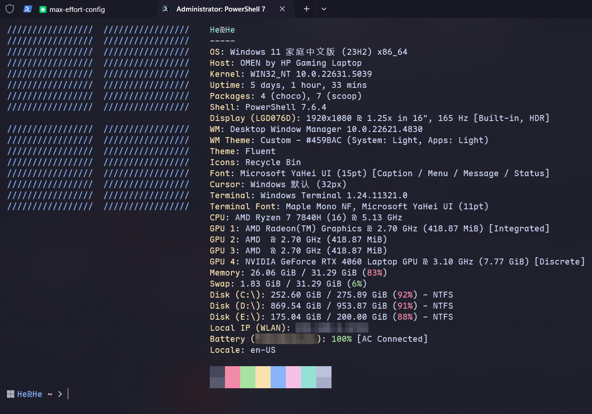

# windows-terminal-catppuccin

一套 Windows Terminal + PowerShell 7 的 Catppuccin Mocha 配置。



## 包含什么

| 层 | 内容 |
|---|---|
| 终端外观 | Catppuccin Mocha 配色、亚克力半透明、无缝标签栏、竖线光标、隐藏滚动条 |
| 字体 | Maple Mono NF（Nerd Font），中文经字体回退链落到 Microsoft YaHei UI |
| 提示符 | oh-my-posh，显示 git 分支与工作区状态、conda 环境、命令耗时、错误码 |
| Shell | PowerShell 7 + PSReadLine 历史预测（灰字补全 + 列表视图） |
| 杂项 | `ls` 文件类型图标（Terminal-Icons）、开机 fastfetch 信息图 |

「无缝标签栏」来自主题里的 `tab.background: "terminalBackground"` —— 活动标签底色跟终端背景完全一致，标签栏和内容区之间那条分界线会消失。

## 依赖

- Windows Terminal **1.20+**（字体回退链需要）；本配置在 1.24 上验证
- [scoop](https://scoop.sh)
- 可选：conda（配置会自动探测，没装就跳过）

## 安装

```powershell
git clone https://github.com/Deco025/windows-terminal-catppuccin.git
cd windows-terminal-catppuccin
.\install.ps1
```

脚本会装齐 pwsh / oh-my-posh / fastfetch / Maple Mono NF / Terminal-Icons，把三个配置文件放到位，并关掉 conda 自带的 `(base)` 前缀（否则会和 oh-my-posh 的 python 段重复显示）。**覆盖任何已有文件之前都会先备份成 `*.bak-<时间戳>`。**

装完**新开一个 Windows Terminal 窗口** —— 根级 `theme` 只在新窗口生效，开新标签不行。

### 手动安装

| 仓库里的文件 | 放到 |
|---|---|
| `windows-terminal/settings.json` | `%LOCALAPPDATA%\Packages\Microsoft.WindowsTerminal_8wekyb3d8bbwe\LocalState\settings.json` |
| `powershell/Microsoft.PowerShell_profile.ps1` | `$PROFILE`（即 `~\Documents\PowerShell\`，**不是** `WindowsPowerShell`） |
| `oh-my-posh/catppuccin_mocha.omp.json` | `~\.config\oh-my-posh\` |

主题放 `~/.config` 而不是直接改 oh-my-posh 自带的那份，是为了让 `scoop update oh-my-posh` 不会把它覆盖掉。

## 常用调整

**透明度** —— `settings.json` 里 `profiles.defaults.opacity`，85 是折中值，想更透就调到 70，不喜欢就把 `useAcrylic` 改成 `false`。

**中文严格等宽** —— Maple Mono NF 不含 CJK 字形，中文是靠 `font.face` 里的回退链渲染的。想要中文严格 2:1 对齐，换成带 CJK 的版本：

```powershell
scoop install nerd-fonts/Maple-Mono-NF-CN
```

然后把 `font.face` 改成 `"Maple Mono NF CN"`。

**换提示符主题** —— `Get-ChildItem $env:POSH_THEMES_PATH` 看 oh-my-posh 自带的一百多套，改 profile 里那行 `--config` 即可。

**本机专有路径** —— profile 会加载 `~/.config/pwsh/local.ps1`（不入库）。conda 装在非标准位置时，在里面写：

```powershell
$CondaExe = 'E:\somewhere\miniconda3\Scripts\conda.exe'
```

## 两个值得记一笔的坑

### 1. conda 在 PowerShell 7 下会完全失效

从 5.1 换到 7 之后 `conda activate` 直接报错：

```
conda-script.py: error: argument COMMAND: invalid choice: ''
```

问题出在 conda 的 PowerShell hook，它是这样调 conda 的：

```powershell
& $Env:CONDA_EXE $Env:_CE_M $Env:_CE_CONDA shell.powershell activate <env>
```

`_CE_M` / `_CE_CONDA` 只有在 conda 以 `python -m conda` 方式运行时才有值，正常安装下它们是**空字符串**。而：

- PowerShell 5.1 会把空字符串参数**丢弃**
- PowerShell 7 默认的 `Standard` 参数传递模式会把它**原样传出去**

于是 `conda.exe` 收到的第一个参数是 `""`，被当作 COMMAND 解析，报错。

**解决**：profile 里加一行，切回 5.1 的参数传递语义。

```powershell
$PSNativeCommandArgumentPassing = 'Legacy'
```

另外两种看起来可行、实测**不行**的做法：

- 在 hook 之后 `Remove-Item Env:_CE_M, Env:_CE_CONDA` —— 只能生效一次。`conda activate` 内部会重新执行 hook，把这两个变量又设回空字符串。
- 把 `$PSNativeCommandArgumentPassing = 'Legacy'` 放进包住 `Invoke-Conda` 的包装函数里 —— 这个偏好变量对原生命令调用不按动态作用域生效，完全不起作用。

conda 24.x 已修复此问题，升级后可以删掉那一行。

### 2. `intenseTextStyle` 要设成 `all` 而不是 `bright`

官方 Catppuccin 配色把 8 个亮色映射成了和普通色**完全相同**的值（`brightRed` = `red` = `#F38BA8`，八个都这样）。

所以如果按传统习惯设成 `"bright"`，终端里所有 `ESC[1m`（加粗/强调）的文本 —— `ls` 的表头、`git status` 的标题行、各种 `--help` 的小节名 —— 会和普通文本长得一模一样，强调效果被彻底抹平。设成 `"all"` 才会用上 Maple Mono NF 的 Bold 字面。

（fastfetch 底部那两行色块看起来只有一行，也是这个原因 —— 其实是普通色和亮色两行，只是完全相同。）

## 卸载 / 回滚

`install.ps1` 会把原文件备份成 `*.bak-<时间戳>`，改回去即可。另外：

```powershell
conda config --set changeps1 True
scoop uninstall pwsh oh-my-posh fastfetch
Uninstall-Module Terminal-Icons
```

## 致谢

[Catppuccin](https://github.com/catppuccin/windows-terminal) ·
[oh-my-posh](https://ohmyposh.dev) ·
[Maple Mono](https://github.com/subframe7536/maple-font) ·
[fastfetch](https://github.com/fastfetch-cli/fastfetch) ·
[Terminal-Icons](https://github.com/devblackops/Terminal-Icons)
