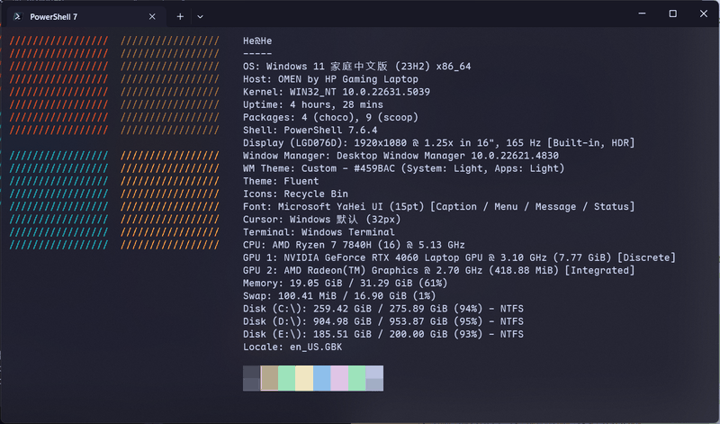

# windows-terminal-catppuccin

English | [简体中文](README.zh-CN.md)

[](LICENSE)
[](https://github.com/Deco025/windows-terminal-catppuccin/stargazers)
[](https://aka.ms/terminal)

A ready-to-run Catppuccin Mocha setup for Windows Terminal + PowerShell 7, with a one-click installer.




## What you get

| Layer | Contents |
|---|---|
| Terminal | Catppuccin Mocha colors, acrylic translucency, seamless tab bar, bar cursor, hidden scrollbar |
| Font | Maple Mono NF (Nerd Font); CJK text falls back to Microsoft YaHei UI |
| Prompt | oh-my-posh with git branch/status, conda environment, command duration, exit code |
| Shell | PowerShell 7 + PSReadLine history prediction (gray inline + list view) |
| Extras | Terminal-Icons for `ls`, fastfetch system info with a four-color Windows logo |

The seamless tab bar is one line. The theme sets the active tab background to `tab.background: "terminalBackground"`, so the tab blends with the terminal background and the divider disappears.

## Prerequisites

- Windows Terminal 1.21 or newer. Font fallback chains and the `tabRow` / `tab` theme keys were added in this release. Verified on 1.24.
- [scoop](https://scoop.sh). The script does not install scoop and exits if it cannot find it.
- conda is optional. The script auto-detects standard install paths and skips it otherwise.

## Install

```powershell
git clone https://github.com/Deco025/windows-terminal-catppuccin.git
cd windows-terminal-catppuccin
.\install.ps1
```

The script installs pwsh / oh-my-posh / fastfetch / Maple Mono NF / Terminal-Icons, copies the config files (terminal settings, PowerShell profile, oh-my-posh theme, fastfetch config + logo), and disables conda's `(base)` prefix so it does not duplicate the oh-my-posh python segment. The real PowerShell 7 profile path is asked from `pwsh` itself, so OneDrive-redirected Documents folders are handled correctly. Existing files are backed up as `*.bak-<timestamp>` before being overwritten.

Open a new Windows Terminal window afterwards. The root-level `theme` applies to new windows only; a new tab is not enough.

If the execution policy blocks the script:

```powershell
powershell -ExecutionPolicy Bypass -File .\install.ps1
```

Add `-Force` to skip the confirmation prompt.

### Manual install

| File | Destination |
|---|---|
| `windows-terminal/settings.json` | `%LOCALAPPDATA%\Packages\Microsoft.WindowsTerminal_8wekyb3d8bbwe\LocalState\settings.json` |
| `powershell/Microsoft.PowerShell_profile.ps1` | `$PROFILE` (run `echo $PROFILE` in PowerShell 7 to confirm the path) |
| `oh-my-posh/catppuccin_mocha.omp.json` | `~\.config\oh-my-posh\` |
| `fastfetch/config.jsonc` | `~\.config\fastfetch\` |
| `fastfetch/win11-logo.txt` | `~\.config\fastfetch\` |

The theme is installed as a separate copy under `~/.config` so `scoop update oh-my-posh` will not overwrite it.

### Install with an AI assistant

Send the repo link to an AI assistant that can run terminal commands and ask it to execute:

```powershell
git clone https://github.com/Deco025/windows-terminal-catppuccin.git
cd windows-terminal-catppuccin
pwsh -NoProfile -ExecutionPolicy Bypass -File .\install.ps1 -Force
```

This works when scoop and Windows Terminal are already installed and scoop lives at the default `%USERPROFILE%\scoop`. If scoop is missing the script exits; if Windows Terminal is missing it skips settings.json; if scoop lives in a custom directory the hard-coded pwsh path in settings.json breaks. Machines with a custom scoop directory or OneDrive-redirected Documents may need manual adjustment.

## Common tweaks

**Opacity**. `profiles.defaults.opacity` in settings.json. 85 is the default compromise, 70 is more transparent, and `useAcrylic: false` disables acrylic.

**Strict CJK width**. Maple Mono NF has no CJK glyphs; Chinese renders through the fallback chain in `font.face`. For strict 2:1 alignment install the CJK version and set `font.face` to `"Maple Mono NF CN"`:

```powershell
scoop install nerd-fonts/Maple-Mono-NF-CN
```

**Prompt theme**. `Get-ChildItem $env:POSH_THEMES_PATH` lists the 100+ themes shipped with oh-my-posh; change the `--config` line in the profile.

**fastfetch logo colors**. The four-pane Windows logo uses the Windows brand palette. Because fastfetch's builtin-logo color slots are broken on Windows (see Known issues), the colors are baked into [`fastfetch/win11-logo.txt`](fastfetch/win11-logo.txt) as inline ANSI truecolor sequences — edit that file to change them.

**Machine-specific paths**. The profile loads `~/.config/pwsh/local.ps1`, which is not committed. For non-standard conda installs put the following there:

```powershell
$CondaExe = 'E:\somewhere\miniconda3\Scripts\conda.exe'
```

## Known issues

### conda fails in PowerShell 7 with `invalid choice: ''`

After moving from PowerShell 5.1 to 7, `conda activate` may fail with:

```
conda-script.py: error: argument COMMAND: invalid choice: ''
```

conda's PowerShell hook invokes:

```powershell
& $Env:CONDA_EXE $Env:_CE_M $Env:_CE_CONDA shell.powershell activate <env>
```

`_CE_M` and `_CE_CONDA` are normally empty strings. PowerShell 5.1 drops empty-string arguments; PowerShell 7's Standard mode passes them through, so conda receives an empty first argument and parses it as COMMAND.

The profile already contains the fix:

```powershell
$PSNativeCommandArgumentPassing = 'Legacy'
```

Newer conda versions fixed the root cause (24.9+; PowerShell 7.5 requires 25.1.1+). After upgrading, you can remove the line and test.

### `intenseTextStyle` must be `all`, not `bright`

The official Catppuccin palette maps the eight bright colors to the same values as their normal counterparts, `brightRed` equals `red`, and so on. With `"bright"`, all `ESC[1m` emphasized text, such as `ls` headers, `git status` titles, and `--help` section names, looks identical to normal text. `"all"` enables Maple Mono NF's bold face.

The two color rows at the bottom of the fastfetch output look like one row for the same reason. Normal and bright colors are just identical.

### fastfetch's builtin logo colors don't work (Windows)

Setting `logo.color` for the builtin `windows11` logo (or the `--logo-color-1` … CLI flags) does **nothing** on the Windows builds of fastfetch 2.66–2.68 — the `$1`–`$4` color placeholders in the logo are never substituted with escape sequences, so the logo renders entirely in the default foreground color and the four-color Windows flag comes out flat grey. Module colors (keys, color blocks) are unaffected; only the logo is.

The repo works around it by skipping `$N` placeholders entirely: [`fastfetch/win11-logo.txt`](fastfetch/win11-logo.txt) embeds the four brand colors (`#F25022` / `#7FBA00` / `#00A4EF` / `#FFB900`) as literal ANSI truecolor sequences, and the shipped `fastfetch/config.jsonc` loads it as a file logo:

```jsonc
"logo": { "type": "file", "source": "~/.config/fastfetch/win11-logo.txt" }
```

(`install.ps1` rewrites this to an absolute path during install; if you install manually and the logo doesn't show, expand `~` to an absolute path.)

## Uninstall / rollback

`install.ps1` backs up existing files as `*.bak-<timestamp>`. To remove the rest:

```powershell
conda config --set changeps1 True
scoop uninstall pwsh oh-my-posh fastfetch
Uninstall-Module Terminal-Icons
```

## License

[MIT](LICENSE)

## Credits

[Catppuccin](https://github.com/catppuccin/windows-terminal) · [oh-my-posh](https://ohmyposh.dev) · [Maple Mono](https://github.com/subframe7536/maple-font) · [fastfetch](https://github.com/fastfetch-cli/fastfetch) · [Terminal-Icons](https://github.com/devblackops/Terminal-Icons)